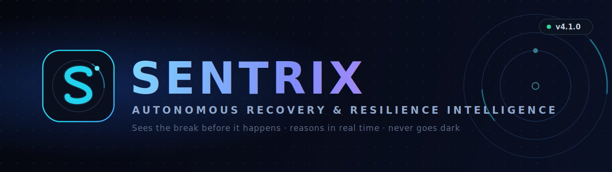

<div align="center">



# SENTRIX

### Autonomous Recovery & Resilience Intelligence

*"Sees the break before it happens. Reasons in real time. Never goes dark."*

[](#-changelog)
[](https://www.python.org/)
[](https://fastapi.tiangolo.com/)
[](https://react.dev/)
[](#-real-time-mode-not-a-simulation)
[](#-provider-agnostic-reasoning)
[](#)

**An autonomous agent for IT backup & disaster-recovery readiness. It perceives a fleet in real time, reasons about each asset with a language model that actually owns its decisions, remembers what it decided last cycle, predicts breaches before they happen, acts, and explains every call — with a deterministic guardrail that enforces only the hard safety floors, so the AI stays free to reason but can never do harm.**

[Quickstart](#-quickstart) · [What's new in v4](#-whats-new-in-v40--the-rebuild) · [Real-time mode](#-real-time-mode-not-a-simulation) · [Architecture](#-architecture) · [API](#-api-reference) · [Changelog](#-changelog)

</div>

---

## 📖 What is SENTRIX?

Most backup tools are passive: something breaks → a log is written → a human reads it → a human decides → a human acts. SENTRIX collapses that loop into an **autonomous agent**:

> **Problem occurs → SENTRIX perceives it → reasons about it in context and history → decides → acts → explains → and a deterministic guardrail validates only the hard-safety boundaries.**

It watches a fleet of backup assets, calculates how much of each asset's **Recovery Point Objective (RPO)** is consumed, weighs criticality and *trajectory*, escalates only what genuinely needs a human, and gives a plain-English justification every time.

| Typical backup tool | **SENTRIX** |
|---------------------|-------------|
| Static `IF threshold THEN alert` | **LLM/SLM reasoning** over evidence, criticality, and **memory of past cycles** |
| Shows what happened | **Acts** autonomously (escalate, retry, schedule restore-test) |
| Black-box alerts | **Explains every decision**, and shows where AI and policy **disagreed** |
| Cloud-dependent | Runs **100% offline** on a local model, or free cloud, or pure rule engine |
| Demo data only | **Real-time ingestion** — syslog / JSON / Prometheus push real telemetry |
| Breaks if a dep is missing | **Graceful degradation** at every layer — never goes dark |

---

## ⚡ What's new in v4.0 — the rebuild

v4 is a ground-up fix of the thing that made the previous generation feel like a rule engine wearing an AI costume, plus a real-time production path and a full security pass.

### 1. The AI now actually reasons (and has authority)
Previously the prompt handed the model the exact rules, the model answered, and a validator **overwrote every decision** with the rule engine — keeping only the sentence. Three "brains" were forced to agree with the dumbest one.

**Now:** the model reasons from evidence + history and **owns its decision**. The deterministic policy runs afterward as a **guardrail that enforces only hard safety floors** (a genuine tier-1 P1 the model under-called) and otherwise **lets the model's call stand** — recording any disagreement as a `diverged` flag with both opinions kept. That divergence surface is the most valuable output in the system, and it used to be silently deleted. See it live on the **Divergence** dashboard tab or `GET /api/divergence`.

### 2. It remembers — the loop that makes it an agent
A new **decision memory** (`agent/memory/decision_memory.py`) feeds each asset's recent history back into reasoning ("escalated twice, still failing", "risk climbed 20→80 over 3 cycles"). This produces **early-warning signals before a threshold trips** (`GET /api/memory/signals`) — an agent that evolves, not a stateless function with a log file.

### 3. Real-time, not simulation-only
A new **ingestion gateway** (`agent/ingestion/realtime_gateway.py`) with **syslog, JSON, and Prometheus** adapters accepts real telemetry over `POST /api/ingest`. Flip `SENTRIX_MODE=live` (or `hybrid`) and the exact same agent reasons over your real fleet. Silent assets (no telemetry past a threshold) are themselves treated as a risk signal.

### 4. Security hardened
- Write/ingest endpoints require a **bearer token** (`SENTRIX_API_TOKEN`); the API **refuses to start unprotected in production**.
- CORS defaults **locked to `localhost:3000`** (was wildcard).
- **No stack traces** leaked to clients.
- The forged-cycle hole (anyone could push fake P1s to every dashboard) is closed.

### 5. Real-data grounding actually works on clone
`scripts/fetch_loghub.py` pulls the small LogHub sample logs so the calibrated error rates and real evidence lines are populated — previously empty on a fresh clone.

---

## 🚀 Quickstart

> **Prerequisites:** Python 3.11+, Node.js 18+, Git

```bash
git clone <your-fork-url> SENTRIX
cd SENTRIX

python -m venv venv && source venv/bin/activate      # Windows: venv\Scripts\activate
pip install -r requirements.txt

python scripts/fetch_loghub.py                        # real-data grounding (few MB)
cd dashboard && npm install && cd ..

cp .env.example .env                                  # add your ONE LLM key (optional)
```

**Run it (macOS / Linux):**
```bash
./start.sh
```
**Run it (Windows one-click):** double-click `start.bat`.

**Run it manually (3 terminals):**
```bash
uvicorn api.main:app --reload --port 8000    # API       → http://localhost:8000/docs
python -m agent.main                          # Agent loop
cd dashboard && npm start                     # Dashboard → http://localhost:3000
```

SENTRIX runs with **zero keys** on the guardrail engine. Add one free key (OpenRouter or NVIDIA) to `.env` to unlock full AI reasoning.

---

## 🌐 Real-time mode (not a simulation)

SENTRIX has three fleet modes, set by `SENTRIX_MODE`:

| Mode | Source | Use |
|------|--------|-----|
| `simulation` (default) | deterministic LogHub-grounded fleet | demos, offline, CI |
| `live` | real telemetry pushed to `/api/ingest` | production |
| `hybrid` | simulator baseline + live overrides | migration / mixed |

**Push real telemetry** (any of three shapes):

```bash
# 1) JSON — your backup/monitoring system already knows this
curl -X POST localhost:8000/api/ingest -H "Authorization: Bearer $SENTRIX_API_TOKEN" \
  -H "Content-Type: application/json" \
  -d '{"source":"json","payload":{"asset_id":"PROD-DB-01","tier":1,"criticality_score":95,
        "rpo_target_hours":2,"hours_since_last_backup":9,"consecutive_failures":3}}'

# 2) Syslog — point rsyslog / journald forwarders here
curl -X POST localhost:8000/api/ingest -H "Authorization: Bearer $SENTRIX_API_TOKEN" \
  -H "Content-Type: application/json" \
  -d '{"source":"syslog","payload":"backupd - Backup FAILED for asset=PROD-DB-01"}'

# 3) Prometheus — scrape output
curl -X POST localhost:8000/api/ingest -H "Authorization: Bearer $SENTRIX_API_TOKEN" \
  -H "Content-Type: application/json" \
  -d '{"source":"prometheus","payload":"backup_age_seconds{asset=\"PROD-DB-01\"} 32400"}'
```

On the next cycle the agent reasons over that real asset exactly like any other. Recognized Prometheus metrics: `backup_age_seconds`, `backup_consecutive_failures`, `restore_test_overdue_days`, `asset_criticality`, `asset_tier` (all labelled `asset="…"`).

---

## 🧠 How reasoning works (LLM authority + guardrail)

```
                 ┌────────────── evidence + criticality + MEMORY ────────────────┐
   perceive ───► │  Reasoner:  local SLM → cloud LLM chain → guardrail engine    │
                 └───────────────────────────┬───────────────────────────────────┘
                                             ▼
                                 model decides + explains
                                             ▼
                     ┌──────── GUARDRAIL (hard safety floors only) ──────────┐
                     │ under-called a real tier-1/2 streak? → raise + FLAG   │
                     │ invalid action?                      → policy default │
                     │ disagreed with soft policy?          → keep + FLAG    │
                     │ otherwise                            → MODEL STANDS   │
                     └──────────────────────────┬────────────────────────────┘
                                             ▼
                              act · publish · remember · audit
```

The guardrail is a **floor, not a ceiling**. Divergences are signal, exposed at `/api/divergence`.

---

## 🔌 One key, any provider

SENTRIX needs exactly **one LLM API key** — no more. It speaks the standard
OpenAI-compatible wire format, so the same four variables work with whichever
provider you choose (OpenRouter, NVIDIA NIM, Groq, Together, Fireworks,
DeepInfra, a local vLLM, and so on):

```bash
LLM_PROVIDER=openrouter                       # a label for logs
LLM_API_KEY=sk-or-...                          # your one key
LLM_MODEL=openrouter/free                      # a model id from that provider
LLM_BASE_URL=https://openrouter.ai/api/v1      # the provider endpoint (omit for Google Gemini)
```

That's the whole setup. If no key is present, the deterministic guardrail engine
takes over automatically — SENTRIX **never stops reasoning and never crashes the
loop.** (Prefer fully offline? Set `SENTRIX_USE_LOCAL=true` and point it at a
local Ollama instead of a cloud key.)

---

## 🧬 Fine-tuned SLM (optional, fully offline brain)

SENTRIX can run on a **locally fine-tuned Small Language Model** (LoRA), trained on its own decision policy:

```bash
python scripts/slm_dataset.py --n 4000      # build reasoning-style SFT data from ground truth
python scripts/slm_train.py --max-steps 400 # LoRA fine-tune (CPU-friendly; scale on GPU)
python scripts/slm_infer.py                 # sanity-check the adapter
# then set SENTRIX_USE_SLM=true in .env
```

> **Honest note:** the repo ships the training *pipeline* and a demo adapter. A strong production SLM needs a real training run on capable hardware — the scripts are built to do exactly that when you point them at a GPU. v4 upgraded the dataset generator to teach **reasoning with evidence and tier tradeoffs**, not just policy parroting.

---

## 🖥️ Dashboard (11-tab live console)

Overview · Live Feed · Forecast · AI Engine · Reasoning · **Divergence (new)** · Simulation · Assets · Risk Map · Restore · Audit — plus a conversational copilot grounded in live fleet state, streaming over WebSocket.

---

## 🧾 API reference

| Method | Endpoint | Auth | Purpose |
|--------|----------|------|---------|
| GET | `/api/health` | – | fleet + provider status |
| GET | `/api/mode` | – | current fleet mode |
| GET | `/api/assets?dataset=` | – | current fleet state |
| GET | `/api/predictions` | – | RPO-breach forecasts |
| GET | `/api/divergence` | – | **AI vs policy disagreements** |
| GET | `/api/memory` · `/api/memory/signals` | – | **agent memory + early warnings** |
| POST | `/api/ingest` | ✅ token | **push real telemetry** |
| GET | `/api/ingest/status` | – | live ingestion stats |
| POST | `/api/ingest/reset` | ✅ token | clear live fleet |
| POST | `/api/agent/cycle` | ✅ token | agent posts a completed cycle |
| POST | `/api/simulate/trigger` | – | run a scenario |
| POST | `/api/chat` | rate-limited | conversational copilot |
| GET | `/api/actions?status=` | – | action records (pending/dry-run/executed) |
| POST | `/api/actions/approve` · `/reject` | ✅ token | approve or reject a queued action |
| WS | `/ws/ingest?token=` | ✅ token | **streaming telemetry ingest** |
| GET | `/api/ml-status` | – | transformer / anomaly / YOLO / TS status |
| WS | `/ws` | – | live cycle + ingest stream |

Interactive docs at `http://localhost:8000/docs`.

---

## 🏗️ Architecture

```
SENTRIX/
├─ agent/
│  ├─ main.py                    # autonomous loop: perceive→reason→predict→act→publish
│  ├─ config.py                  # one config surface
│  ├─ security.py                # write-endpoint auth + prod startup policy   [NEW]
│  ├─ reasoning/
│  │  ├─ reasoning_core.py       # LLM authority + guardrail + memory          [REWRITTEN]
│  │  ├─ llm_providers.py        # multi-provider client, auto-failover
│  │  ├─ slm_local.py            # offline fine-tuned SLM runtime
│  │  ├─ predictive_engine.py    # trend-based RPO-breach forecasting
│  │  ├─ transformer_engine.py   # DistilBERT log severity / similarity (optional)
│  │  └─ anomaly_detector.py     # LSTM + statistical anomaly scoring (optional)
│  ├─ memory/
│  │  ├─ decision_memory.py      # per-asset rolling memory + drift signals    [NEW]
│  │  └─ audit_logger.py         # HMAC-signed, local-first audit trail
│  ├─ ingestion/
│  │  ├─ realtime_gateway.py     # live telemetry → normalized fleet state     [NEW]
│  │  ├─ fleet_source.py         # sim | live | hybrid selector                [NEW]
│  │  ├─ adapters/               # syslog · json · prometheus                  [NEW]
│  │  └─ loghub_engine.py        # deterministic, LogHub-calibrated simulator
│  ├─ ml/time_series.py          # deep-learning forecasting cascade (optional)
│  └─ vision/yolo_monitor.py     # YOLOv8 visual monitoring (optional)
├─ api/main.py                   # FastAPI control plane + WebSocket + ingest  [UPGRADED]
├─ dashboard/                    # React live console (+ Divergence tab)       [UPGRADED]
├─ scripts/
│  ├─ fetch_loghub.py            # pull real sample logs for grounding         [NEW]
│  ├─ slm_dataset.py             # reasoning-style SFT data builder            [UPGRADED]
│  └─ slm_train.py · slm_infer.py
├─ assets/                       # logo.svg · banner.svg (+ PNG renders)       [NEW]
├─ start.sh · start.bat          # one-command launchers (mac/linux + windows)
└─ .env.example
```

---

## 🧩 Tech stack & versions

| Layer | Technology | Version policy |
|-------|------------|----------------|
| Agent + API | Python | 3.11+ |
| API framework | FastAPI + Uvicorn + WebSockets | latest compatible via `requirements.txt` |
| Reasoning | OpenRouter / NVIDIA NIM / Gemini / OpenAI-compatible / Ollama / local LoRA SLM | any one key |
| Optional ML | PyTorch · HuggingFace Transformers · PEFT (LoRA) · Ultralytics YOLOv8 · statsmodels | lazy-loaded; system degrades gracefully without them |
| Frontend | React 18 · lucide-react · framer-motion · tsparticles | Node 18+ |
| Persistence | local JSONL (default) · Supabase (optional) · Redis hook (optional) | zero-config default |
| Deploy | Docker + docker-compose (one command) | single-worker default (see security notes) |

> Versions are intentionally specified as ranges in `requirements.txt` so a fresh
> `pip install` resolves cleanly against live PyPI. Pin your own lock file for
> production (`pip freeze > requirements.lock`) after a verified install.

---

## 🔒 Security notes

- Set **`SENTRIX_API_TOKEN`** and **`SENTRIX_ENV=production`** before deploying — the API refuses to start unprotected in production.
- Change **`SENTRIX_HMAC_KEY`** from its default (it signs the audit trail).
- CORS is locked to `http://localhost:3000` by default; widen via `SENTRIX_CORS_ORIGINS`.
- For multi-worker deploys, wire `REDIS_URL` (cycle history and live fleet are per-process — run single-worker until Redis is enabled).

---

## 📊 How to benchmark (the honest way)

SENTRIX ships a benchmark harness that scores any reasoning backend against a
held-out expert scenario suite (never seen in training — different seed):

```bash
python scripts/benchmark.py --backend rule -n 300   # 1. the floor every model must beat
python scripts/benchmark.py --backend llm  -n 300   # 2. your configured provider
python scripts/benchmark.py --backend slm  -n 300   # 3. your fine-tuned model
```

Metrics that matter for an ops agent: **action accuracy**, **safety-violation
rate** (chose below the hard floor — weighted 5× in the score), under/over-
escalation rates, JSON validity, and latency p50/p95, broken down per scenario
family (plain / memory / transient / corruption / sparse). Reports land in
`data/benchmarks/`. Reference baseline: the rule engine scores **~0.73** —
perfect on plain policy, but only **0.35 on corruption detection** and **0.48
on transient handling**. Those gaps are exactly what a reasoning model is for;
a backend earns production by beating the rule engine on weighted score with
**zero** safety violations.

---

## 📜 Changelog

### v4.1.0 — "The Operator" (all tiers shipped)
- **Action execution layer** — RETRY_BACKUP / SCHEDULE_RESTORE_TEST now flow through real connectors (templated commands, orchestrator webhook) with four safety modes: `off · dry_run (default) · approve · auto`; human approval API (`/api/actions`, `/api/actions/approve|reject`); every attempt persisted + audited.
- **SQLite persistence** — cycles, actions, and incident history survive restarts (WAL, stdlib, zero deps); dashboard restores history on boot.
- **Async + batched reasoning** — LLM calls moved off the event loop (chat can no longer stall WebSocket broadcasts); fleets chunked at `SENTRIX_BATCH_SIZE=25` so free-tier models never receive a 100-asset mega-prompt.
- **Tool-use agency** (`SENTRIX_AGENCY`) — on escalations/divergences the model *investigates*: chooses among memory / forecast / similar-incidents / fleet-context tools, then finalizes, with the full investigation trace attached.
- **Analyst + Critic** (`SENTRIX_CRITIC`) — an independent second pass tries to talk down every P1/P2 before a human is paged; downgrades only within safety bounds, verdict recorded.
- **Incident RAG** (`SENTRIX_RAG`, on by default) — similar past incidents recalled into reasoning prompts; dependency-free cosine similarity over the SQLite incident store.
- **Notification fan-out** — Slack, Discord, PagerDuty Events v2, SMTP email + Telegram, fired concurrently, failure-isolated.
- **Streaming ingest** — persistent `ws://…/ws/ingest?token=…` WebSocket for high-frequency telemetry alongside HTTP push.
- **Rate limiting** — token-bucket on `/api/chat` and `/api/ingest`.
- **Training data v2** — expert-policy curriculum: memory-trend, transient-vs-persistent, integrity/corruption, and sparse-input families (~55% reasoning-heavy examples).
- **Benchmark harness** — `scripts/benchmark.py` scores rule/LLM/SLM backends on accuracy, safety violations, escalation bias, latency.
- **Tests + CI** — 11-test pytest suite covering guardrail, adapters, gateway, memory, executor, expert policy, RAG; GitHub Actions workflow.
- **Requirements modernized & split** — light `requirements.txt` (FastAPI 0.115+, httpx 0.27+) and optional `requirements-ml.txt` (torch 2.4+, transformers 4.44+); Python 3.11/3.12.
- **NEXORA fully removed** — zero references remain anywhere, including env vars.

### v4.0.0 — "SENTRIX" (rename + rebuild)
- **Reasoning core rewritten:** LLM owns decisions; guardrail enforces hard safety floors only; disagreements flagged (`diverged`), not erased; `model_action` + `guardrail_note` preserved on every assessment.
- **Decision memory:** per-asset rolling history fed back into reasoning; rising-risk early-warning signals (`/api/memory/signals`).
- **Real-time ingestion gateway:** syslog / JSON / Prometheus adapters; `live` and `hybrid` fleet modes; stale-asset (silent host) detection as a risk signal.
- **Security:** bearer-token auth on write/ingest endpoints; production startup guard; CORS locked down; traceback leaks removed.
- **Grounding fix:** `scripts/fetch_loghub.py`; real evidence + calibrated error rates now populate on a fresh clone.
- **SLM pipeline upgraded** to reasoning-style training examples (evidence citation, tier tradeoffs, proportionality).
- **Rebrand:** NEXORA → SENTRIX across code, dashboard, launchers, Docker; new logo + banner.
- **Dashboard:** new **Divergence** tab (AI-vs-policy review + live ingest telemetry); v4 landing.
- **New launchers:** cross-platform `start.sh` alongside `start.bat`.

### v3.x — "SENTRIX" (predecessor)
Deterministic LogHub-grounded simulator, multi-provider LLM chain with auto-failover, HMAC-signed audit trail, 10-tab React console with WebSocket streaming, LoRA SLM fine-tuning pipeline, predictive RPO-breach engine.

---

## 📝 License & credits

Built with open-source models from HuggingFace and Ultralytics, and the [LogHub](https://github.com/logpai/loghub) dataset collection. Free for learning and evaluation.

<div align="center">


**SENTRIX v4.1.0** — *Sees the break before it happens.*

</div>
